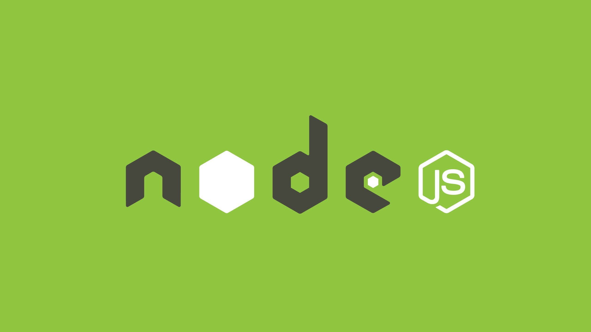

<h1 align="center"> Sistema de login - Coleta de dados </h1>

Testando conceitos com pacotes: bodyParser e Express-Session.

  <a href="#-tecnologias">Tecnologias</a>&nbsp;&nbsp;&nbsp;|&nbsp;&nbsp;&nbsp;
  <a href="#-projeto">Projeto</a>&nbsp;&nbsp;&nbsp;|&nbsp;&nbsp;&nbsp;
  <a href="#-layout">Layout</a>&nbsp;&nbsp;&nbsp;|&nbsp;&nbsp;&nbsp;
  <a href="#memo-licença">Licença</a>

 

  

## 🚀 Tecnologias

Esse projeto foi desenvolvido com as seguintes tecnologias:

- HTML e CSS
- NodeJS/JavaScript
- Github

## 💻 Projeto

Este modelo, serve para mostrar meu aprendizado em utilizar alguns pacotes adicionais como "bodyParser" e "express-session", além de aprender mais sobre coleta de dados com o uso do GET e POST

## 🔖 Layout

Você pode visualizar o layout do projeto através [DESSE LINK](https://www.youtube.com/watch?v=J0F8Cc4t5po). Irei sempre que possivel postar alguns projetos lá! Se puder inscreva-se!

Necessário ter conta no [YOUTUBE](https://www.youtube.com/) para se inscrever!.

---

Feito com ♥ por Pedro Igor Campos Costa - 2ª Semestre - Ciência da computação! :wave:
